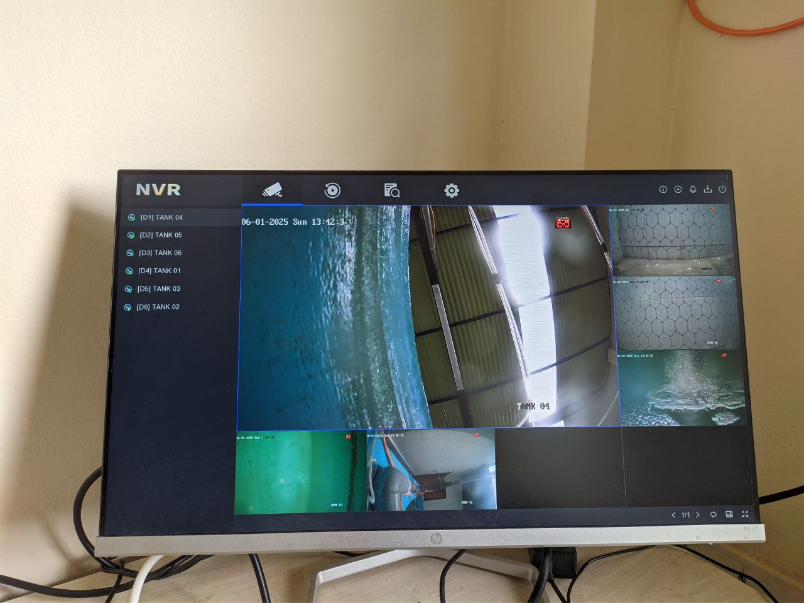
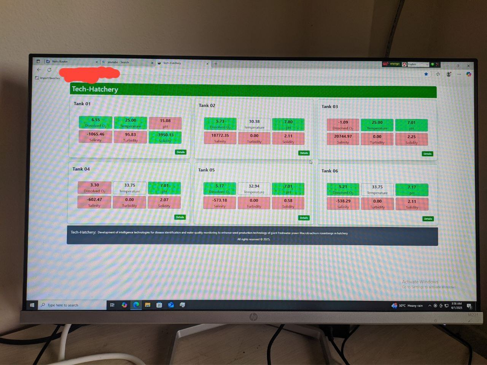
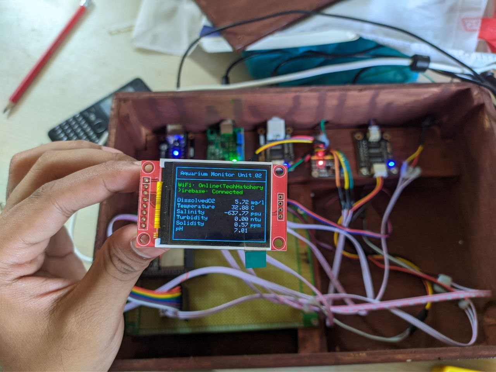

# Aquarium Monitoring System

A comprehensive IoT-based aquarium monitoring system that tracks water quality parameters across multiple tanks using ESP32 microcontrollers, TFT displays, and a centralized web dashboard with NVR camera feeds.

## Overview

This project implements an intelligent aquarium monitoring solution designed to maintain optimal water conditions for aquatic life. The system monitors critical parameters including dissolved oxygen, temperature, salinity, turbidity, solidity, and pH levels across multiple tanks simultaneously.

## System Architecture

### NVR Camera Monitoring System
The system incorporates a Network Video Recorder (NVR) interface that displays live feeds from 6 cameras positioned at different aquarium tanks, providing visual monitoring capabilities alongside sensor data collection.

  

### Web-Based Monitoring Dashboard
A comprehensive web dashboard called "Tech-Hatchery" provides real-time monitoring of all 6 aquarium tanks, displaying critical water quality parameters including dissolved oxygen, temperature, salinity, turbidity, solidity, and pH levels for each tank.

  

### Individual Hardware Monitoring Units
Each tank is equipped with a dedicated monitoring unit featuring an ESP32 microcontroller and TFT display. The unit shows real-time water quality metrics directly on the screen, including dissolved oxygen (5.72 mg/L), temperature (32.89°C), salinity (-632 psu), turbidity (0.00 NTU), solidity (0.52 ppm), and pH (7.01).

  

## Key Features

- **Multi-tank Monitoring**: Simultaneous monitoring of up to 6 aquarium tanks
- **Real-time Data Collection**: Continuous measurement of water quality parameters
- **Visual Monitoring**: Integrated camera system with NVR for visual tank monitoring
- **Web Dashboard**: Centralized web interface for monitoring all tanks
- **Local Display**: Individual TFT displays on each monitoring unit
- **IoT Connectivity**: Wi-Fi enabled ESP32 controllers for remote monitoring

## Monitored Parameters

Each monitoring unit tracks the following water quality parameters:

- **Dissolved Oxygen**: Critical for fish respiration (measured in mg/L)
- **Temperature**: Water temperature monitoring (°C)
- **Salinity**: Salt content measurement (psu - practical salinity units)
- **Turbidity**: Water clarity measurement (NTU - Nephelometric Turbidity Units)
- **Solidity**: Total dissolved solids (ppm - parts per million)
- **pH Level**: Water acidity/alkalinity (pH scale)

## Hardware Components

### ESP32 Microcontroller
The system uses ESP32 boards as the main processing unit for each monitoring station, providing:
- Wi-Fi connectivity for data transmission
- Multiple GPIO pins for sensor connections
- Built-in ADC for analog sensor readings

### TFT Display (ST7735)
Each unit features a color TFT display showing real-time readings and system status.

#### Pin Configuration

| Display Pin  | ESP32 Pin  |
|--------------|------------|
| LED          | 3.3V       |
| SCK          | D18        |
| SDA (MOSI)   | D23        |
| A0 (DC)      | D5         |
| Reset        | D19        |
| CS           | D21        |
| GND          | GND        |
| VCC          | 3.3V       |

### Camera System
- 6 IP cameras positioned at each tank
- NVR (Network Video Recorder) for centralized video management
- Real-time streaming capabilities

## Installation

### Repository Setup

